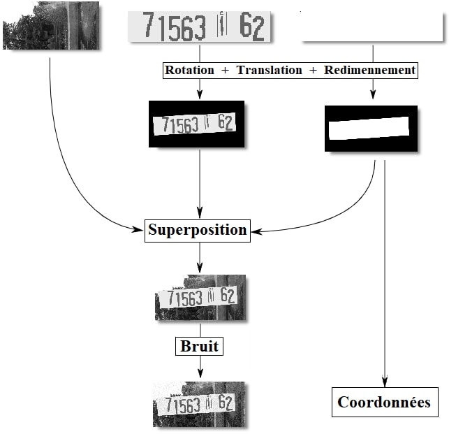
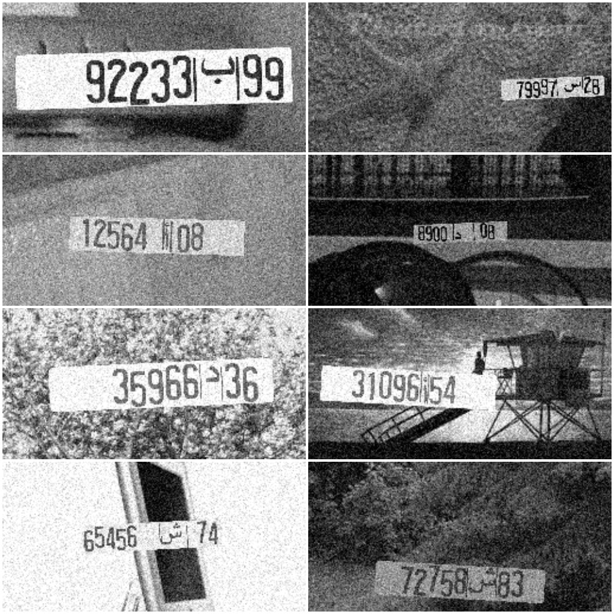
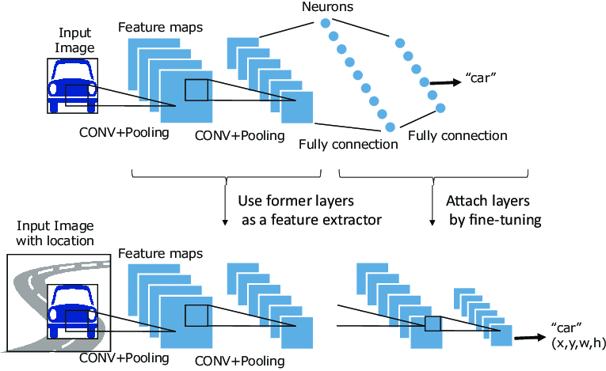
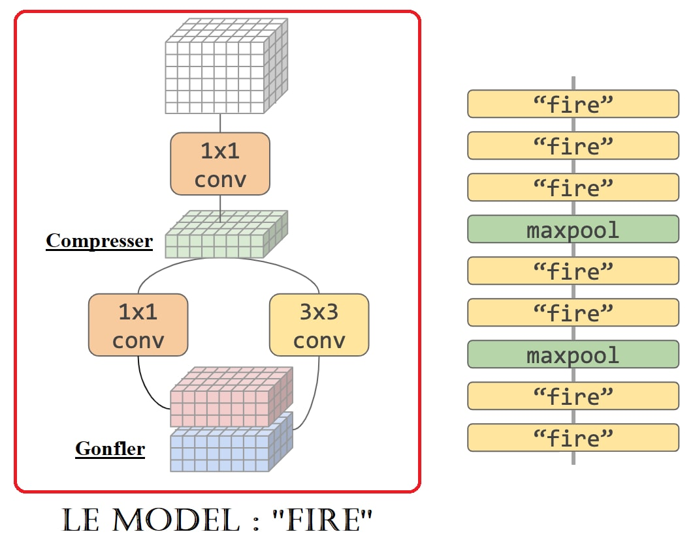
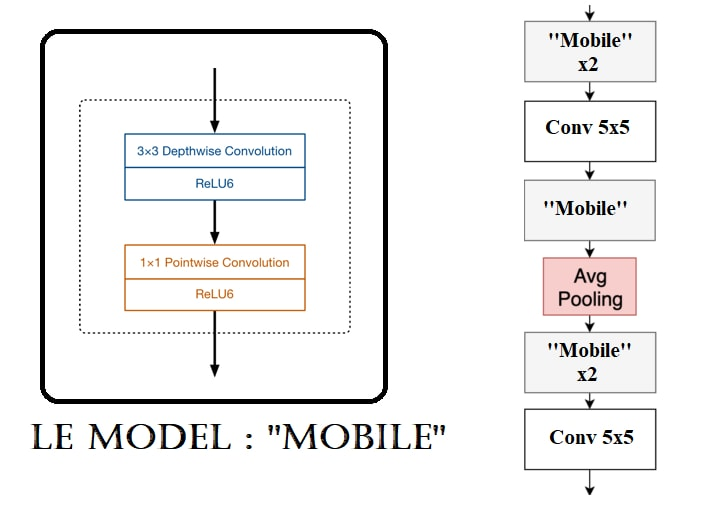
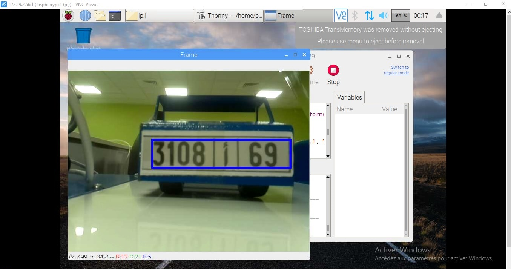
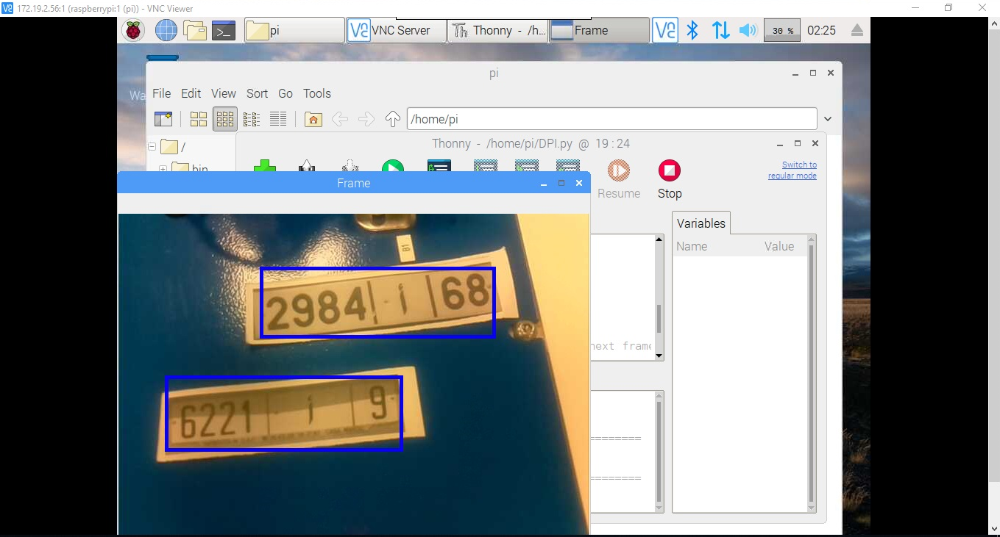

# plate-detector
A machine learning algorithm for Moroccan car plates detection, trained only with synthesized data (no real data used).

## Context
This work is part of my TIPE project during my second year in CPGE (2019).

## Problem description
Car plates detection is an image processing that like many others can be solved with better accuracy with deep learning algorithms.
The only problem with this approach was the dataset. I could've used a dataset from the internet, but since this dataset problem occurs in many occasions as the bottleneck of machine learning, I decided to build this project with zero real data.

## Solution
Only with some image processing operations (OpenCV) and a negative background dataset (images of random scenes), I built a data generator that generates images with car plates (Moroccan car plate) along with the needed annotations (coordinates) in no time. And to make the detection harder I added noise on top of the images, I tilted the car plates and rotated them along both axes.

  
  

And for the detection I re-implemented the YOLO algorithm in Google's ML framework TensorFlow.

  

## Let's make it even more challenging
To make this solution cheaper and to implement it in small embedded systems such as Raspberry Pi, I went through different CNN architectures and modified the original features extractor (Darknet) with Google and Stanford's fastest (SqueezeNet and MobileNet).

  
  
  MobNet

With these modifications I achieved real time (30 fps) detection with less memory, less training time and less computation.

  
  

## Results
You could see the results of my work as well as the whole project's goal and steps in the final presentation.
